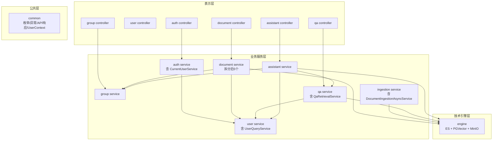

# Argus-backend 模块重构设计方案

> 版本：v1.0  
> 日期：2026-05-06  
> 状态：设计已确认，待制定实施计划

---

## 1. 背景与动机

### 1.1 当前问题

通过对项目结构的全面审查，识别出以下 9 个问题：

| # | 问题 | 严重程度 |
|---|------|---------|
| 1 | `resources/ArgusBackendApplication.java` — Java 源文件误放在资源目录中 | 🔴 高 |
| 2 | `DocumentService.java` 797 行，承担上传/下载/预览/删除/补偿/事件发布 6+ 种职责 | 🔴 高 |
| 3 | `DocumentService` 7 个方法接受 `HttpServletRequest` 参数 — Web 层对象穿透到 Service 层 | 🔴 高 |
| 4 | `auth` 与 `user` 模块边界模糊 — `CurrentUserService` 放在 `auth`，依赖 `auth.security` 内部实现的同时又依赖 `user.mapper.UserMapper`；若简单迁移到 `user`，会反向依赖 `auth.security` | 🟡 中 |
| 5 | `DocumentIngestionAsyncService` 归属错误 — 放在 `document.service` 但直接依赖 `ingestion` 模块的 mapper/entity/service | 🟡 中 |
| 6 | `retrieval`（ES+PGVector）与 `qa/rag`（混合检索）检索职责重叠分散 | 🟡 中 |
| 7 | `storage` 模块过于轻量（3 个类），`retrieval` 模块仅 2 个类，缺乏存在必要性 | 🟡 中 |
| 8 | `assistant` 模块直接依赖 `qa` 模块内部类（`ReadyChunkDocumentRetriever`、`CitationAssembler`）— 缺少对外接口 | 🟡 中 |
| 9 | `ingestion` 模块 9 个子包平铺，`parser`/`reader`/`transformer` 作为顶层包暴露过多细节 | 🟢 低 |

### 1.2 重构目标

- **高内聚低耦合**：每个模块职责单一、边界清晰
- **无上帝类**：单个文件不超过 300 行
- **分层清晰**：Service 层不接收 Web 层对象（`HttpServletRequest`），Controller 负责提取用户身份后传入业务参数
- **基础设施收敛**：ES、PGVector、MinIO 统一放在 `engine` 包中
- **RAG 链路清晰**：写入链路（document→ingestion→engine）和检索链路（qa→engine→qa）职责分明
- **跨模块依赖通过接口**：`qa` 模块暴露检索接口供 `assistant` 调用，`ingestion` 模块暴露处理接口供事件消费

---

## 2. 重构范围

**三层联动**：

| 层级 | 改动范围 | 示例 |
|------|---------|------|
| 模块级 | 合并/拆分/重命名顶层模块 | `retrieval` + `storage` → `engine`；`DocumentIngestionAsyncService` 迁入 `ingestion` |
| 包级 | 模块内部子包重组 | `ingestion` parser/reader/transformer 归入 `service/pipeline/`；`UserContext` 迁入 `common/security/` |
| 类级 | 大文件拆分 + 分层修复 | `DocumentService` → 5 个 Service；移除 `HttpServletRequest` 参数；`qa` 新增 `QaRetrievalService` 接口 |

---

## 3. 重构后模块结构

### 3.1 顶层模块（10 个 → 9 个，2 合 1 删）

```
com.argus.rag/
├── auth/              # 认证模块（登录/JWT/密码/CurrentUserService）
├── user/              # 用户管理模块（用户 CRUD、UserQueryService）
├── group/             # 群组与权限模块（原 groupmembership）
├── document/          # 文档管理模块
├── ingestion/         # 文档 ETL 模块（含 DocumentIngestionAsyncService）
├── engine/            # 技术引擎模块（ES + PGVector + MinIO，原 retrieval + storage）
├── qa/                # 知识问答模块（暴露 QaRetrievalService 供 assistant 调用）
├── assistant/         # AI Agent 模块
└── common/            # 公共模块（含 security/UserContext）
```

### 3.2 各模块职责边界

| 模块 | 核心职责 | 暴露接口 | 禁止操作 |
|------|---------|---------|---------|
| `auth` | 登录/登出、JWT 签发与校验、Token 刷新、密码加密、当前用户获取 | `AuthService`、`CurrentUserService` | 不直接操作 `user.mapper.UserMapper`（通过 `UserQueryService` 接口查询用户） |
| `user` | 用户 CRUD、密码修改、状态管理、用户查询 | `AccountService`、`AdminUserService`、`UserQueryService` | 不依赖 `auth` 模块的任何类 |
| `group` | 群组 CRUD、成员管理、邀请/申请审批、权限校验 | `GroupManagementService`、`GroupMembershipService` | 不操作文档/问答数据 |
| `document` | 文档上传（小文件/分片/秒传）、下载、预览、删除、查询、ETL 事件发布 | `DocumentUploadService`、`DocumentQueryService`、`DocumentDownloadService`、`DocumentPreviewService`、`DocumentDeleteService` | 不直接操作 ES/PGVector/MinIO；Service 方法不接收 `HttpServletRequest` |
| `ingestion` | 文档解析、清洗、分片、向量写入、ES 索引、异步 ETL 消费 | `EtlDocumentIngestionProcessor`、`DocumentIngestionAsyncService`（从 document 迁入） | 不访问群组/用户权限 |
| `engine` | ES 索引管理、PGVector 检索、MinIO 对象存储 | `ElasticsearchChunkIndexService`、`PgVectorRetrievalAdapter`、`ObjectStorageService` | 不包含业务逻辑（纯技术组件） |
| `qa` | RAG 问答：查询规划、混合检索、大模型对话、回答解析；对外暴露检索能力 | `QaService`、`HybridChunkRetrievalService`、`QaRetrievalService`（新增，供 assistant 调用） | 不操作文档上传/删除 |
| `assistant` | AI Agent 对话：会话管理、记忆管理、Agent 编排、工具调用 | `AssistantConversationService`、`AssistantAgentFacade` | 不直接依赖 `qa.rag.ReadyChunkDocumentRetriever`（改为依赖 `QaRetrievalService` 接口） |
| `common` | 枚举、异常、日志、API 响应封装、OpenAPI 配置、安全上下文持有器 | 公共类、`UserContext`（从 `auth.security` 迁入） | 不包含任何业务逻辑 |

### 3.3 模块内部组织规范

```
<module>/
├── controller/     # 对外 API 入口
├── service/        # 业务逻辑（可含子包）
├── mapper/         # 数据访问（MyBatis-Plus）
├── model/
│   ├── entity/     # 数据库实体
│   ├── dto/        # 入参对象
│   └── vo/         # 出参对象
├── config/         # 模块专属 Spring 配置（可选）
├── event/          # 模块专属事件定义（可选）
└── support/        # 模块内部工具/辅助类（可选）
```

**规范要点**：

1. 禁止 controller 直接注入 mapper，必须通过 service
2. entity 不跨模块引用，跨模块传数据只用 DTO/VO
3. config 只放本模块的 `@Configuration` 类，全局共享的放 `common/config`
4. `support/` 只被本模块使用，不允许被其他模块 import

---

## 4. 类级拆分方案

### 4.1 DocumentService 拆分（797 行 → 5 个文件）

**拆分前**：

```
document/service/
├── DocumentService.java                     (797 行 — 上帝类，含 HttpServletRequest 参数)
├── DocumentUploadService.java               (分片上传)
├── DocumentIngestionAsyncService.java       (ETL 触发逻辑，但错误地放在 document 模块)
├── DocumentIngestionAsyncListener.java
├── DocumentIngestionRequestedEvent.java
└── StaleProcessingDocumentRecoveryRunner.java
```

**拆分后**：

```
document/service/
├── DocumentUploadService.java               (直接上传 + 秒传 + 分片完成 + 事件发布, ~250 行)
├── DocumentQueryService.java                (列表查询, ~100 行)
├── DocumentPreviewService.java              (预览, ~80 行)
├── DocumentDownloadService.java             (下载, ~120 行)
├── DocumentDeleteService.java               (删除 + 重试, ~150 行)
├── DocumentIngestionAsyncListener.java
├── DocumentIngestionRequestedEvent.java
└── StaleProcessingDocumentRecoveryRunner.java

ingestion/service/
└── DocumentIngestionAsyncService.java       (从 document 模块迁入)
```

**拆分变更要点**：

1. **不提取 `DocumentIngestionEventPublisher`**：事件发布（`applicationEventPublisher.publishEvent(...)` 仅一行代码），直接内联在 `DocumentUploadService.persistAndFinalizeUploadedDocument()` 中，无需独立类。
2. **`DocumentIngestionAsyncService` 迁入 `ingestion` 模块**：此文件直接依赖 `ingestion.mapper.DocumentChunkMapper`、`ingestion.model.entity.DocumentChunkEntity`、`ingestion.service.DocumentIngestionProcessor`、`ingestion.vector.VectorIngestionService`——是 ingestion 模块的内部逻辑，不应留在 document。
3. **所有新 Service 方法不接收 `HttpServletRequest`**：Controller 层负责调用 `CurrentUserService` 提取 `userId`，Service 方法只接收业务参数。

**搬移顺序**（按依赖由少到多）：

| 步骤 | 目标 | 依赖 |
|------|------|------|
| 1 | `DocumentIngestionAsyncService` 迁入 `ingestion` | 先迁出，减少 document 模块对 ingestion 的耦合 |
| 2 | `DocumentPreviewService` | `DocumentMapper` + `GroupMembershipService` |
| 3 | `DocumentDownloadService` | `DocumentMapper` + `ObjectStorageService` |
| 4 | `DocumentQueryService` | `DocumentMapper` + `GroupMembershipService` |
| 5 | `DocumentDeleteService` | `DocumentMapper` + `engine`（ES + PGVector + MinIO） |
| 6 | `DocumentUploadService`（原 `DocumentService` 剩余部分） | `DocumentMapper` + `ObjectStorageService` + `ApplicationEventPublisher` |

**HttpServletRequest 移除示例**：

```java
// 拆分前（DocumentService）
public Long uploadDocument(HttpServletRequest request, UploadDocumentRequest uploadRequest) {
    Long groupId = requireGroupId(uploadRequest.getGroupId());
    CurrentUserService.CurrentUser currentUser = requireGroupOwner(groupId);
    // ...
}

// 拆分后（DocumentUploadService）
public Long uploadDocument(Long userId, UploadDocumentRequest uploadRequest) {
    Long groupId = requireGroupId(uploadRequest.getGroupId());
    requireGroupOwner(userId, groupId);
    // ...
}

// Controller 层负责提取用户身份
@PostMapping("/upload")
public ApiResponse<Long> upload(@Valid UploadDocumentRequest body) {
    CurrentUserService.CurrentUser user = currentUserService.requireBusinessUser();
    return ApiResponse.success(documentUploadService.uploadDocument(user.userId(), body));
}
```

### 4.2 ingestion 模块内部重组

**重组前**（9 个子包平铺）：

```
ingestion/
├── chunk/
├── config/
├── mapper/
├── model/
├── parser/
├── reader/
├── service/
├── transformer/
└── vector/
```

**重组后**（3 个逻辑分组，最大深度 4 层）：

```
ingestion/
├── controller/
├── mapper/
├── model/
│   └── entity/
├── config/
├── service/
│   ├── EtlDocumentIngestionProcessor.java
│   ├── DocumentIngestionAsyncService.java     (从 document 模块迁入)
│   ├── DocumentIngestionProcessor.java
│   └── pipeline/                              # ETL 流水线内部实现（不对外暴露）
│       ├── reader/
│       │   └── StoredObjectDocumentReader.java
│       ├── parser/
│       │   ├── DocumentParserFactory.java
│       │   ├── DocumentParser.java            (接口)
│       │   ├── PdfDocumentParser.java
│       │   ├── DocxDocumentParser.java
│       │   ├── TxtDocumentParser.java
│       │   ├── MdDocumentParser.java
│       │   └── TextDecodingSupport.java
│       ├── transformer/
│       │   ├── TextCleanupTransformer.java
│       │   ├── StructureAwareChunkTransformer.java
│       │   └── ChunkingProperties.java
│       └── ChunkService.java
└── vector/
    └── VectorIngestionService.java
```

**变更说明**：原 `parser/factory/`、`parser/strategy/`、`parser/support/` 三个子包共 7 个类——合并到 `parser/` 同级即可，无需二级子包。`DocumentIngestionAsyncService` 从 `document.service` 迁入（见 4.1 步骤 1）。

### 4.3 engine 模块（原 retrieval + storage）

```
engine/
├── elasticsearch/
│   └── ElasticsearchChunkIndexService.java        (从 retrieval 迁入)
├── pgvector/
│   └── PgVectorRetrievalAdapter.java              (从 retrieval 迁入)
└── storage/
    ├── ObjectStorageService.java                  (从 storage 迁入，接口)
    ├── MinioStorageService.java                   (从 storage 迁入，实现)
    └── MissingObjectStorageService.java           (从 storage 迁入，兜底)
```

**命名说明**：使用 `engine` 而非 `infrastructure`——在 DDD 术语中，"infrastructure"通常指领域层接口的技术实现；此处 ES、PGVector、MinIO 是独立的**技术引擎组件**，`engine` 更准确地传达其定位。业务模块只依赖 `engine` 中的接口（如 `ObjectStorageService`、`PgVectorRetrievalAdapter`），不依赖实现。

**规范**：业务模块只依赖 `ObjectStorageService` 接口，不感知 `MinioStorageService` 实现。

### 4.4 CurrentUserService 依赖解耦

**问题分析**：`CurrentUserService` 位于 `auth`，当前存在双向耦合风险：
- `auth.CurrentUserService` 依赖 `user.mapper.UserMapper` 和 `user.model.entity.User`（auth → user）
- 如果简单移到 `user`，会变为 `user.CurrentUserService` 依赖 `auth.security.JwtAuthenticationFilter` 和 `auth.security.UserContext`（user → auth.security 内部实现）

**方案**：保持 `CurrentUserService` 在 `auth`，通过以下两步消除不合理的依赖：

**步骤 1**：将 `UserContext` 从 `auth.security` 提取到 `common/security/`

```diff
- com.argus.rag.auth.security.UserContext
+ com.argus.rag.common.security.UserContext
```

`UserContext` 是一个基于 `ThreadLocal` 的轻量级持有器，不包含任何安全逻辑，适合放在 `common` 中。这样 `auth` 和 `user` 都可以使用它而不产生相互依赖。

**步骤 2**：`user` 模块暴露 `UserQueryService` 接口，`auth` 通过接口查询用户

```java
// user 模块 — 对外暴露的查询接口（返回 record，不暴露 entity）
@Service
public class UserQueryService {
    private final UserMapper userMapper;

    public UserRecord findById(Long userId) {
        User user = userMapper.selectById(userId);
        if (user == null) return null;
        return new UserRecord(user.getId(), user.getUserCode(),
                user.getDisplayName(), user.getSystemRole(),
                user.getStatus(), user.getMustChangePassword());
    }
}
```

```java
// auth 模块 — 通过接口查询，不直接依赖 mapper
@Service
public class CurrentUserService {
    private final UserQueryService userQueryService;  // user 模块的公开接口

    private CurrentUser loadUserById(Long userId) {
        UserRecord user = userQueryService.findById(userId);
        if (user == null) throw new BusinessException("当前用户不存在");
        if (user.status() == UserStatus.DISABLED)
            throw new BusinessException("账号已被禁用");
        return new CurrentUser(user.userId(), user.userCode(),
                user.displayName(), user.systemRole(), user.mustChangePassword());
    }
}
```

**依赖方向**：`auth → user`（认证模块依赖用户数据模块），这是合理的——认证需要知道"这个用户是否存在、是否被禁用"。反向依赖 `user → auth` 则不存在。

### 4.5 assistant → qa 模块边界规范

**问题**：`AssistantKnowledgeBaseTool` 直接依赖 `qa.rag.ReadyChunkDocumentRetriever`、`qa.rag.RetrievedEvidenceBundle`、`qa.support.CitationAssembler`——这些都是 qa 模块的内部实现类。

**方案**：在 `qa` 模块中新增 `QaRetrievalService` 接口作为对外门面：

```java
// qa 模块 — 对外暴露的检索接口
@Service
public class QaRetrievalService {
    private final ReadyChunkDocumentRetriever documentRetriever;
    private final CitationAssembler citationAssembler;

    public QaRetrievalResult retrieveEvidence(Long groupId, String query) {
        RetrievedEvidenceBundle bundle = documentRetriever.retrieveEvidence(groupId, query);
        List<AskQuestionResponse.Citation> citations = citationAssembler.assembleDocuments(bundle.documents());
        return new QaRetrievalResult(bundle, citations);
    }
}
```

```java
// assistant 模块 — 依赖接口而非内部实现
@Component
public class AssistantKnowledgeBaseTool {
    private final QaRetrievalService qaRetrievalService;  // 替代 ReadyChunkDocumentRetriever + CitationAssembler
    // ...
}
```

`AskQuestionResponse.Citation` 是 VO 类型，跨模块引用 VO 可接受（已在 `assistant` 模块的多个 VO 中使用）。

### 4.6 其他清理项

| 操作 | 目标 | 原因 |
|------|------|------|
| 删除 | `resources/ArgusBackendApplication.java` | Java 源文件误放资源目录 |
| 清理 | `OpenApiConfiguration` 中注释的 `GlobalOpenApiCustomizer` Bean | 死代码 |
| 重命名 | `groupmembership` → `group` | 简洁直观（IDE Move Class 自动重构，注意检查 import 冲突） |

---

## 5. 模块依赖关系



**关键依赖说明**：

| 依赖 | 方向 | 合理性 |
|------|------|--------|
| `auth → user`（`CurrentUserService → UserQueryService`） | 认证层依赖用户数据层 | ✅ 合理：认证需要验证用户是否存在/被禁用 |
| `user → auth` | 无此依赖 | ✅ `user` 模块完全不感知 `auth` |
| `document → engine` | 业务层依赖技术引擎 | ✅ 合理：通过接口依赖（`ObjectStorageService`） |
| `qa → engine` | 检索层依赖技术引擎 | ✅ 合理：直接使用 ES/PGVector |
| `assistant → qa`（`AssistantKnowledgeBaseTool → QaRetrievalService`） | Agent 模块依赖检索服务 | ✅ 合理：通过 qa 模块对外门面接口调用 |
| `assistant → qa.rag.ReadyChunkDocumentRetriever`（重构前） | 跨模块依赖内部实现 | ❌ 不合理：重构后通过 `QaRetrievalService` 消除 |
| `document → ingestion`（重构前 `DocumentIngestionAsyncService`） | 跨模块依赖 mapper/entity | ❌ 不合理：重构后将此文件迁入 `ingestion` 模块 |

**RAG 核心链路**：

```
【写入链路 Write Path】
document/DocumentUploadService
       → engine/ObjectStorageService（存文件）
       → ApplicationEventPublisher.publishEvent(DocumentIngestionRequestedEvent)
            → ingestion/DocumentIngestionAsyncService（@TransactionalEventListener）
                 → ingestion/EtlDocumentIngestionProcessor
                      → pipeline/parser（解析）
                      → pipeline/transformer（清洗 + 分片）
                      → engine/ElasticsearchChunkIndexService（ES 索引）
                      → vector/VectorIngestionService（向量写入 PGVector）

【检索链路 Read Path】
qa/QueryPlanningService（查询规划）
    → qa/HybridChunkRetrievalService（混合检索）
         → engine/PgVectorRetrievalAdapter（向量检索）
         → engine/ElasticsearchChunkIndexService（关键词检索）
    → qa/QaChatService（LLM 答案生成）
    → 返回 AskQuestionResponse

【Agent 链路（KB_SEARCH 模式）】
assistant/AssistantAgentFacade
    → agent/AssistantKnowledgeBaseTool
         → qa/QaRetrievalService.retrieveEvidence()（对外门面接口）
              → qa/HybridChunkRetrievalService（内部复用混合检索）
    → agent/AssistantReactAgentFactory（Agent 编排）
    → memory/AssistantMemorySummarizer（记忆管理）
```

---

## 6. 模块间引用规范

### 6.1 分层调用规则

| 规则 | 说明 |
|------|------|
| 上层不越级调下层 | controller → service → mapper，禁止 controller → mapper |
| Service 层不依赖 Web 层 | Service 方法不接收 `HttpServletRequest`/`HttpServletResponse`，Controller 负责提取用户身份后传入 |
| 同层禁止直接依赖 | `document/service` 不 import `qa/service`，通过事件解耦 |
| 技术引擎只提供接口 | 业务模块依赖 `engine` 中的接口，不依赖实现 |
| 跨模块只传 DTO/VO/Record | entity 不跨模块暴露；跨模块调用通过目标模块的公开 Service |
| 跨模块不直接调 mapper | 即使 entity 在同一数据库中，也必须通过目标模块的 Service 查询 |

### 6.2 同步调用规范

```java
// ✅ 正确：注入接口
public class DocumentUploadService {
    private final ObjectStorageService objectStorageService; // 接口
}

// ❌ 错误：注入实现
public class DocumentUploadService {
    private final MinioStorageService minioStorageService;   // 实现
}

// ✅ 正确：跨模块通过公开 Service 查询
public class CurrentUserService {
    private final UserQueryService userQueryService;  // user 模块的公开接口
}

// ❌ 错误：跨模块直接调用 mapper
public class CurrentUserService {
    private final UserMapper userMapper;  // user 模块的内部 mapper
}
```

### 6.3 异步调用规范（事件驱动）

已有先例复用：

```java
// 发布方（document 模块）
applicationEventPublisher.publishEvent(new DocumentIngestionRequestedEvent(docId, groupId));

// 消费方（ingestion 模块）
@Async
@TransactionalEventListener(phase = TransactionPhase.AFTER_COMMIT)
public void handle(DocumentIngestionRequestedEvent event) { ... }
```

**现有事件**：

| 事件 | 发布方 | 消费方 | 用途 |
|------|--------|--------|------|
| `DocumentIngestionRequestedEvent` | `document` | `ingestion` | 文档上传完成触发 ETL |

**新增推荐事件**：

| 事件 | 发布方 | 消费方 | 用途 | 可靠性保障 |
|------|--------|--------|------|-----------|
| `DocumentDeletedEvent` | `document` | `ingestion` | 文档删除时清理 ES 索引和向量数据 | 同步清理（见下方说明） |

**`DocumentDeletedEvent` 可靠性说明**：

`softDeleteDocument` 当前为**同步清理** ES/PGVector——如果改为异步事件，一旦事件处理器失败（ES 不可用、应用重启），会产生孤儿索引数据。

**推荐方案**：保留同步清理逻辑，事件仅用于**通知和审计日志**（如记录删除操作日志）：

```java
// DocumentDeleteService
@Transactional
public void softDeleteDocument(Long userId, Long groupId, Long documentId) {
    // ... 校验 + 标记删除 ...
    // 同步清理（事务内 — 失败则回滚）
    vectorIngestionService.deleteDocumentVectors(documentId);
    elasticsearchChunkIndexService.deleteDocumentChunks(documentId);
    // 异步通知（事务提交后 — 仅用于审计，失败不影响主流程）
    applicationEventPublisher.publishEvent(new DocumentDeletedEvent(documentId, groupId, userId));
}
```

若确实需要异步清理（例如清理操作耗时长影响响应时间），则需同步实现：
- 事件处理器中使用重试机制（`@Retryable`）
- `StaleProcessingDocumentRecoveryRunner` 增加定期扫描孤儿索引的补偿逻辑

### 6.4 数据传递标准

| 上下文 | 数据形态 | 说明 |
|--------|---------|------|
| 同模块 service → controller | VO/DTO | entity 不暴露到 controller |
| 跨模块 service → service | DTO 或 record | 不允许传 entity |
| 事件 | record | 不可变、字段最少 |
| 跨模块查询 | 归属模块的 service 提供查询接口 | 禁止跨模块直接调用 mapper |
| Controller → Service | 基本类型 + DTO | 禁止传 `HttpServletRequest` |

---

## 7. 迁移路径与实施计划

分 5 个阶段，每阶段独立可提交、可验证、可回滚。

### 阶段一：低风险清理（⭐ 风险最低）

| 步骤 | 操作 | 影响范围 | 验证方式 |
|------|------|---------|---------|
| 1.1 | 删除 `resources/ArgusBackendApplication.java` | 无 | 编译通过 |
| 1.2 | 清理 `OpenApiConfiguration` 注释死代码 | 无 | 编译 + OpenAPI 页面正常 |
| 1.3 | `groupmembership` → `group` 重命名 | 全局 import | 全量编译 + 回归测试 |
| 1.4 | `UserContext` 从 `auth.security` 迁入 `common/security/` | `auth`、所有 filter | 全量编译 + 登录功能测试 |
| 1.5 | `user` 模块新增 `UserQueryService`（若不满足需求） | 无 | 编译通过 |
| 1.6 | `auth.CurrentUserService` 改为依赖 `UserQueryService` 而非 `UserMapper` | `auth` | 编译 + 登录功能测试 |

**风险控制**：步骤 1.3 使用 IDE "Move Class" 自动重构。步骤 1.4 同理。步骤 1.5-1.6 若 `UserQueryService` 已存在则跳过，若不存在则先创建再切换依赖。

### 阶段二：技术引擎合并（⭐ 风险低）

| 步骤 | 操作 | 影响范围 |
|------|------|---------|
| 2.1 | 创建 `engine/` 包及其子包 `elasticsearch/`、`pgvector/`、`storage/` | 无 |
| 2.2 | 将 `retrieval/` 全部迁入 `engine/` | `document`/`ingestion`/`qa` import |
| 2.3 | 将 `storage/` 全部迁入 `engine/storage/` | `document` import |
| 2.4 | 删除空的 `retrieval/` 和 `storage/` 包 | 无 |

**风险控制**：只移动文件不修改内容，import 由 IDE 自动更新。

### 阶段三：类级拆分与分层修复（⭐⭐ 风险中）

| 步骤 | 操作 | 方法 |
|------|------|------|
| 3.1 | `DocumentIngestionAsyncService` 迁入 `ingestion/service/` | 先迁出，消除 document → ingestion 的不合理依赖 |
| 3.2 | 创建 5 个目标 Service 骨架 | 新文件，不影响现有 |
| 3.3 | 逐个搬移方法（见 4.1 搬移顺序表） | 每次搬一个方法组，编译验证 |
| 3.4 | 搬移过程中同步移除 `HttpServletRequest` 参数 | Controller 提取 userId 后传入 |
| 3.5 | 更新 `DocumentController` —— 注入新 Service，Controller 层负责提取用户身份 | 拆解依赖 |
| 3.6 | 删除原 `DocumentService` | 移除旧文件 |
| 3.7 | `qa` 模块新增 `QaRetrievalService`，`AssistantKnowledgeBaseTool` 改为依赖此接口 | 新文件 + 替换注入 |
| 3.8 | 集成测试 | 上传/秒传/分片上传/下载/预览/删除/Agent 对话 |

**风险控制**：每搬完一个 Service 就编译验证。搬移顺序严格遵守依赖由少到多。步骤 3.7 为纯粹的新增门面 + 替换依赖，不影响 qa 模块内部逻辑。

### 阶段四：ingestion 内部重组（⭐ 风险低）

| 步骤 | 操作 |
|------|------|
| 4.1 | 创建 `ingestion/service/pipeline/parser/`、`pipeline/reader/`、`pipeline/transformer/` 包 |
| 4.2 | 将 `reader/`、`parser/`（含所有策略类）、`transformer/`、`ChunkService` 移入 `pipeline/` |
| 4.3 | 将原 `parser/factory/`、`parser/strategy/`、`parser/support/` 内容提升到 `pipeline/parser/` 同级 |
| 4.4 | 删除空的顶层子包 |
| 4.5 | 验证 `EtlDocumentIngestionProcessor` 和 `DocumentIngestionAsyncService` 对 pipeline 的 import 正确 |

### 阶段五：验证与收尾

| 步骤 | 操作 | 验证方式 |
|------|------|---------|
| 5.1 | 全量编译 | `./mvnw clean compile` |
| 5.2 | 单元测试 | `./mvnw test` |
| 5.3 | 功能回归测试 | 登录→创建群组→上传文档→ETL→QA提问→Agent对话→删除文档→删除会话 |
| 5.4 | 清理未使用的 import | IDE "Optimize Imports" 全项目 |

### 测试策略

| 阶段 | 最低验收标准 | 回滚方式 |
|------|-------------|---------|
| 阶段一 | 编译通过 + 全部单元测试通过 + 登录/注册手动测试通过 | `git revert` 该阶段 commit |
| 阶段二 | 编译通过 + 全部单元测试通过 | `git revert` |
| 阶段三 | 编译通过 + 全部单元测试通过 + 上传/秒传/分片上传/下载/预览/删除 手动测试各至少 1 个 case | 每个步骤独立 commit，失败则 revert 该步骤 |
| 阶段四 | 编译通过 + 全部单元测试通过 | `git revert` |
| 阶段五 | 全量功能回归通过 | — |

**分支策略**：每个阶段使用独立分支（如 `refactor/phase-1-cleanup`），通过验证后合并到 `test` 分支。下一阶段从 `test` 分支创建新分支。这样任何阶段出问题，只影响当前阶段的改动。

---

## 8. 重构前后对比

| 维度 | 重构前 | 重构后 |
|------|--------|--------|
| 顶层模块数 | 10 | 9 |
| 最大单文件行数 | 797 (`DocumentService`) | <300 |
| Service 层 `HttpServletRequest` 参数 | `DocumentService` 7 个方法 | 0（全部移除） |
| `resources/` 下误放文件 | 1 个 Java 文件 | 0 |
| `auth ↔ user` 耦合 | `auth` 直接依赖 `user.mapper.UserMapper` | `auth` 通过 `UserQueryService` 接口依赖 `user`，`user` 不依赖 `auth` |
| `document → ingestion` 不当依赖 | `DocumentIngestionAsyncService` 依赖 `ingestion` 内部 mapper/entity | 消除（文件迁入 `ingestion` 模块） |
| `assistant → qa` 内部实现依赖 | 直接依赖 `ReadyChunkDocumentRetriever`、`CitationAssembler` | 通过 `QaRetrievalService` 门面接口调用 |
| 轻量顶层模块 | `retrieval`(2类)、`storage`(3类) | 合入 `engine` |
| `ingestion` 子包层级 | 9 个平铺，parser 含 3 级子包 | 3 个分组，parser 内容提升为 1 层 |
| 命名一致性 | `groupmembership` | `group` |
| `UserContext` 归属 | `auth.security`（只有 auth 能引用） | `common.security`（auth + user 均可引用） |
| 死代码 | 1 处注释 Bean | 0 |
| 跨模块依赖接口 | 部分（`ObjectStorageService`） | 全面（`ObjectStorageService`、`UserQueryService`、`QaRetrievalService`） |

---

## 9. 汇总检查清单

- [ ] 删除 `resources/ArgusBackendApplication.java`
- [ ] 清理 `OpenApiConfiguration` 死代码
- [ ] `groupmembership` → `group` 重命名
- [ ] `UserContext` 从 `auth.security` 迁入 `common/security/`
- [ ] `user` 模块新增/确认 `UserQueryService` 存在，`auth.CurrentUserService` 改为依赖 `UserQueryService`
- [ ] `retrieval` + `storage` → `engine` 合并
- [ ] `DocumentIngestionAsyncService` 从 `document.service` 迁入 `ingestion.service`
- [ ] `DocumentService` 拆分为 5 个 Service（Upload/Query/Preview/Download/Delete）
- [ ] 拆分后的 Service 方法不再接收 `HttpServletRequest`
- [ ] `DocumentController` 更新注入，Controller 层提取 userId
- [ ] `qa` 模块新增 `QaRetrievalService`，`AssistantKnowledgeBaseTool` 改为注入此接口
- [ ] `ingestion` 内部重组（pipeline 子包，parser 策略类提升层级）
- [ ] 更新所有模块的 import
- [ ] 全量编译通过（`./mvnw clean compile`）
- [ ] 全部单元测试通过（`./mvnw test`）
- [ ] 功能回归测试（登录、上传、ETL、问答、Agent 对话、会话管理）

---

## 10. 附录：为什么保留 `auth` 和 `user` 分开

有些项目将认证和用户管理合并为一个模块。本方案选择保留两个独立模块，原因如下：

| 维度 | `auth`（认证） | `user`（用户管理） |
|------|---------------|-------------------|
| 核心关注点 | 我是谁（身份验证） | 我的信息是什么（用户数据管理） |
| 变化频率 | 低（认证协议相对稳定） | 高（用户字段、偏好设置等频繁迭代） |
| 安全敏感度 | 极高（JWT、密码） | 中（用户基础数据） |
| 依赖方向 | 不依赖 `user` | 不依赖 `auth` |
| 独立部署 | 安全组件可单独加固 | 业务组件可独立扩展 |

---

> **下一步**：设计文档确认后，转入 `writing-plans` 制定详细实施任务分解。
