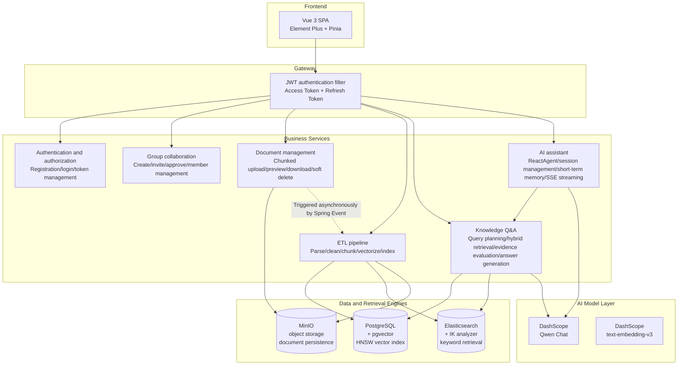

<div align="center">

<a href="README.md">简体中文</a> | <strong>English</strong>

<br/>
<br/>


</div>

<br/>

<h1 align="center">
  <picture>
    <source media="(prefers-color-scheme: dark)" srcset="https://img.shields.io/badge/Argus-RAG_Knowledge_Base_Platform-4A90D9?style=for-the-badge&logo=data:image/svg+xml;base64,PHN2ZyB3aWR0aD0iMjQiIGhlaWdodD0iMjQiIHZpZXdCb3g9IjAgMCAyNCAyNCIgZmlsbD0ibm9uZSI+PGNpcmNsZSBjeD0iMTIiIGN5PSIxMiIgcj0iOSIgc3Ryb2tlPSJ3aGl0ZSIgc3Ryb2tlLXdpZHRoPSIxLjUiLz48Y2lyY2xlIGN4PSIxMiIgY3k9IjEyIiByPSI0IiBzdHJva2U9IndoaXRlIiBzdHJva2Utd2lkdGg9IjEuNSIvPjwvc3ZnPg==&logoColor=white&labelColor=2a6cb6"/>
    
  </picture>
</h1>

<p align="center">
  <strong>An enterprise-grade intelligent knowledge platform powered by RAG and AI Agent technology</strong>
</p>

<p align="center">
  Every answer should be traceable: document upload · intelligent parsing · hybrid retrieval · AI conversation · citation provenance
</p>

<p align="center">
  <a href="#why-choose-argus">Why Argus</a> ·
  <a href="#core-highlights">Core Highlights</a> ·
  <a href="#system-architecture">System Architecture</a> ·
  <a href="#feature-modules">Feature Modules</a> ·
  <a href="#technology-stack">Technology Stack</a> ·
  <a href="#quick-start">Quick Start</a> ·
  <a href="#api-overview">API Overview</a> ·
  <a href="#project-structure">Project Structure</a>
</p>

<br/>

---

## Why Choose Argus?

> **Argus** is named after the hundred-eyed giant in Greek mythology. Even while asleep, some of Argus's eyes stayed watchful. The name reflects the platform's goal: to observe and understand private knowledge assets comprehensively, so **every answer can be backed by evidence**.

**Argus** is not another "ChatGPT wrapper". It is a ground-up **RAG (Retrieval-Augmented Generation) knowledge base platform** that deeply integrates enterprise private documents with large language models, addressing three core pain points in vertical LLM applications:

| Pain Point | Argus Solution |
|------|-----------------|
| **Hallucinated answers** | Hybrid retrieval + evidence evaluation + structured output ensure answers are grounded in real documents, with proactive refusal when the evidence is insufficient. |
| **Fragmented knowledge** | Automatic document parsing, chunking, vectorization, and indexing connect the full path from files to usable knowledge. |
| **Memoryless conversations** | ReactAgent plus three-level short-term memory compression supports context-aware multi-turn conversations. |

<br/>

## Core Highlights

<table>
<tr>
<td width="50%">

### End-to-End RAG Pipeline

Argus builds a complete **RAG pipeline** from document upload to AI answer generation:

```text
Document upload -> Intelligent parsing -> Text chunking
    ↓
Vector embedding (PGvector HNSW) + keyword indexing (Elasticsearch IK)
    ↓
User question -> Query planning (LLM) -> Hybrid retrieval (RRF fusion)
    ↓
Evidence evaluation (four sufficiency levels) -> LLM generation -> citation provenance
```

It is **not a simple "search + GPT wrapper"**. Argus implements key stages such as query planning, RRF fusion ranking, and four-level evidence evaluation.

</td>
<td width="50%">

### AI Agent Conversation Engine

Built on the **Spring AI Alibaba ReactAgent** graph execution engine, Argus supports:

- **Dual-mode switching**: pure chat (`CHAT`) and knowledge base retrieval (`KB_SEARCH`) can switch dynamically within the same session.
- **Tool orchestration**: the Agent decides whether to call retrieval tools, with at most one retrieval call per turn to avoid waste.
- **SSE streaming output**: model responses are streamed token by token to the frontend for a zero-wait experience.
- **Short-term memory**: three-level progressive compression (session memory -> compact summary -> runtime truncation) keeps long conversations usable within limited context windows.

</td>
</tr>
<tr>
<td width="50%">

### Hybrid Retrieval Architecture

**Vector semantic retrieval + keyword full-text retrieval** run in parallel, then RRF (Reciprocal Rank Fusion) merges and ranks the results:

- **Semantic matching**: PGvector + HNSW index + `COSINE_DISTANCE` capture semantic similarity.
- **Exact matching**: Elasticsearch + IK Chinese analyzer + BM25 accurately match domain terms.
- **Evidence enhancement**: cluster aggregation and neighbor-window expansion add context and reduce chunk fragmentation.

</td>
<td width="50%">

### Enterprise-Grade Security

- **Three-level role permissions**: Admin / Group Owner / Member, following the principle of least privilege.
- **JWT dual-token flow**: Access Token (15 min) + Refresh Token (`httpOnly` Cookie + database rotation).
- **BCrypt password hashing** with forced password changes.
- **Group data isolation**: both vector retrieval and Elasticsearch retrieval apply `groupId` filters to prevent cross-group data leakage.
- **AOP operation logs**: critical operations are tracked end to end.

</td>
</tr>
</table>

<br/>

## System Architecture



<br/>

## Feature Modules

### User Authentication and Group Collaboration

- User registration/login, JWT dual-token authentication, and role permissions (Admin / regular user).
- Create knowledge-base groups, invite members through invite codes, and handle join requests with approval workflows.
- Three group roles: Owner / Manager / Member, with fine-grained permission control.

### Full Document Lifecycle Management

- **Chunked upload protocol**: three stages (`init -> chunk upload -> complete`) with resumable upload and instant-upload detection via SHA-256.
- **Multi-format parsing**: PDF / DOCX / MD / TXT with automatic encoding detection.
- **Asynchronous ETL pipeline**: Spring Event + `@Async` + `@Retryable`, with seven fully automated processing steps.
- **Object storage**: MinIO S3-compatible storage, enabled on demand through `@ConditionalOnProperty`.

### Knowledge Base Q&A (RAG Q&A)

- **LLM query planning**: automatically chooses `DIRECT`, `REWRITE`, or `DECOMPOSE`, with up to three parallel retrieval queries.
- **RRF dual-channel fusion**: unifies vector and keyword results, with cluster aggregation and neighbor-window expansion.
- **Four-level evidence evaluation**: `NONE -> WEAK -> PARTIAL -> SUFFICIENT`; the system refuses to answer when evidence is insufficient.
- **Citation provenance**: each answer includes cited chunks, source documents, and relevance scores.

### AI Assistant

- **ReactAgent graph execution engine**: a complete "think -> tool call -> generate response" flow.
- **CHAT / KB_SEARCH dual modes**: pure conversation or knowledge base retrieval, dynamically switchable inside one session.
- **BEFORE_MODEL hook**: automatically injects context before model calls (`compact summary -> session memory -> recent messages`).
- **Three-level short-term memory compression**:
  - L1 session memory: incremental LLM summaries that preserve key facts and decisions.
  - L2 compact summary: condensed historical context that removes redundant details.
  - L3 runtime truncation: the final safeguard when tokens exceed 50,000.
- **SSE streaming output**: delta deduplication plus `AGENT_MODEL_FINISHED` fallback.

<br/>

## Technology Stack

### Backend Core

| Layer | Technology | Version | Description |
|------|------|------|------|
| Language | **Java** | 21 | Records, virtual threads, pattern matching |
| Framework | **Spring Boot** | 3.5.0 | Spring MVC, Jakarta EE 9+ |
| ORM | **MyBatis-Plus** | 3.5.15 | Lambda type-safe queries |
| Database | **PostgreSQL + pgvector** | 16+ | HNSW vector index, `COSINE_DISTANCE` |
| Search Engine | **Elasticsearch** | 8.x | IK Chinese analyzer, direct JDK HttpClient integration |
| Object Storage | **MinIO** | latest | S3-compatible storage, `composeObject` for chunk merging |
| AI Chat | **Spring AI Alibaba** | 1.1.2.0 | Native DashScope integration (Qwen) |
| AI Agent | **Spring AI Alibaba Agent** | 1.1.2.0 | ReactAgent graph execution engine |
| AI Embedding | **Spring AI** | 1.1.2 | OpenAI-compatible mode, 512-dimensional vectors |
| Authentication | **JJWT** | 0.12.6 | HMAC-SHA256 JWT issuing and parsing |
| Password Hashing | **Spring Security Crypto** | - | BCrypt adaptive hashing |
| Document Parsing | **Apache PDFBox / POI** | 2.0.31 / 5.2.5 | PDF + DOCX text extraction |
| Retry Framework | **Spring Retry** | - | Declarative retry with `@Retryable` + `@Recover` |
| API Docs | **Knife4j + SpringDoc** | 4.5.0 | Enhanced `/doc.html` UI and online debugging |

### Frontend Core

| Layer | Technology | Version |
|------|------|------|
| Language | **TypeScript** | 6.0 |
| Framework | **Vue 3** (Composition API) | 3.5 |
| Build Tool | **Vite** | 8.0 |
| Routing | **Vue Router** | 5.0 |
| State Management | **Pinia** | 3.0 |
| UI Components | **Element Plus** | 2.14 |
| HTTP Client | **Axios** | 1.16 |
| Markdown | **marked** | 18.0 |

### Infrastructure

| Component | Purpose |
|------|------|
| **PostgreSQL + pgvector** | Relational primary storage + HNSW vector index (512 dimensions, `COSINE_DISTANCE`) |
| **Elasticsearch 8.x** | IK Chinese analyzer + BM25 keyword retrieval + two-stage bool/rescore scoring |
| **MinIO** | S3-compatible object storage, chunk merging with `composeObject`, conditional assembly |
| **DashScope** | Qwen Chat model + text-embedding-v3 embedding model |

<br/>

## Quick Start

### Requirements

| Component | Version | Description |
|------|---------|------|
| **JDK** | 21 | Records and virtual threads |
| **Node.js** | >= 20.19 | Frontend build |
| **PostgreSQL** | 16+ | Requires the `pgvector` extension |
| **Elasticsearch** | 8.x | Requires the IK Chinese analyzer plugin |
| **MinIO** | latest | Object storage, optional |
| **DashScope API Key** | - | Shared by LLM Chat and Embedding |

### 1. Initialize Middleware

<details>
<summary><b>PostgreSQL + pgvector</b></summary>

```bash
# Install pgvector extension
psql -h <host> -U <user> -d <database> -c "CREATE EXTENSION IF NOT EXISTS vector;"

# Run schema script
psql -h <host> -U <user> -d <database> -f sql/schema.sql
```
</details>

<details>
<summary><b>MinIO (Docker)</b></summary>

```bash
docker run -d --name minio \
  -p 9000:9000 -p 9001:9001 \
  -e MINIO_ROOT_USER=minioadmin \
  -e MINIO_ROOT_PASSWORD=minioadmin \
  minio/minio server /data --console-address ":9001"

# Visit http://localhost:9001 and create a bucket.
# Default bucket: argus-rag-documents
```
</details>

<details>
<summary><b>Elasticsearch + IK Analyzer</b></summary>

```bash
docker run -d --name elasticsearch \
  -p 9200:9200 -p 9300:9300 \
  -e "discovery.type=single-node" \
  -e "xpack.security.enabled=false" \
  elasticsearch:8.x

# Install IK analyzer
docker exec -it elasticsearch bin/elasticsearch-plugin install \
  https://github.com/medcl/elasticsearch-analysis-ik/releases/download/v8.x/elasticsearch-analysis-ik-8.x.zip
docker restart elasticsearch
```
</details>

### 2. Configure Environment

Edit `Argus-backend/src/main/resources/application-local.yml` and fill in database, middleware, and LLM settings:

```yaml
# Database
spring.datasource.url: jdbc:postgresql://localhost:5432/argus_rag
spring.datasource.username: your_username
spring.datasource.password: your_password

# LLM
spring.ai.dashscope.api-key: ${DASHSCOPE_API_KEY}
spring.ai.openai.api-key: ${DASHSCOPE_API_KEY}  # Shared with DashScope

# Object storage (optional)
storage.minio.endpoint: http://localhost:9000
storage.minio.access-key: minioadmin
storage.minio.secret-key: minioadmin

# Elasticsearch
elasticsearch.host: localhost
elasticsearch.port: 9200
```

### 3. Start Backend

```bash
# Set JDK 21
export JAVA_HOME="/path/to/jdk-21"

cd Argus-backend

# Compile
./mvnw clean compile

# Start. The default profile is local, and the default port is 10001.
./mvnw spring-boot:run

# API docs: http://localhost:10001/doc.html
```

### 4. Start Frontend

```bash
cd Argus-frontend

npm install
npm run dev

# Visit: http://localhost:5173
```

### Default Account

In the development environment (`--spring.profiles.active=dev`), an administrator account is created automatically:

| Username | Password | Role |
|--------|------|------|
| `admin` | `admin123` | System Administrator |

<br/>

## API Overview

### Authentication · `/api/auth`

| Method | Path | Description |
|------|------|------|
| POST | `/api/auth/register` | Register a user |
| POST | `/api/auth/login` | Log in and return Access + Refresh Token |
| POST | `/api/auth/refresh` | Refresh token using the Refresh Token in the cookie |
| POST | `/api/auth/logout` | Log out and clear the Refresh Token |
| GET | `/api/auth/me` | Get current user information |

### Group Collaboration · `/api/groups`

| Method | Path | Description |
|------|------|------|
| POST | `/api/groups` | Create a group |
| GET | `/api/groups` | Query visible groups |
| POST | `/api/groups/{id}/invitations` | Create an invitation |
| POST | `/api/groups/{id}/join-request` | Request to join |
| POST | `/api/groups/invitations/{id}/accept` | Accept an invitation |
| DELETE | `/api/groups/{id}/members/{userId}` | Remove a member |

### Document Management · `/api/documents`

| Method | Path | Description |
|------|------|------|
| POST | `/api/documents/upload/init` | Initialize chunked upload with instant/resume detection |
| POST | `/api/documents/upload/chunks` | Upload a chunk |
| POST | `/api/documents/upload/{id}/complete` | Complete upload and trigger ETL |
| POST | `/api/documents/upload` | Upload a small file directly (<=10 MB) |
| GET | `/api/documents` | List documents with multiple filters |
| GET | `/api/documents/{id}/preview` | Preview a document |
| GET | `/api/documents/{id}/download` | Download a document |
| DELETE | `/api/documents/{id}` | Soft-delete a document |

### Knowledge Base Q&A · `/api/qa`

| Method | Path | Description |
|------|------|------|
| POST | `/api/qa/ask` | Submit a question and receive an AI answer with citations |

<details>
<summary><b>Request/Response Example</b></summary>

**Request**:

```json
{
    "groupId": 1,
    "question": "What is the document upload flow? How can I retry after an upload failure?"
}
```

**Response**:

```json
{
    "answered": true,
    "answer": "The document upload flow has three stages: initialization, chunk upload, and final merge. First, call /upload/init to initialize the session...",
    "citations": [
        {
            "documentId": 1,
            "chunkId": 15,
            "fileName": "Argus User Manual.pdf",
            "score": 0.97
        }
    ]
}
```
</details>

### AI Assistant · `/api/assistant`

| Method | Path | Description |
|------|------|------|
| POST | `/api/assistant/sessions` | Create a new session |
| GET | `/api/assistant/sessions` | List sessions |
| PATCH | `/api/assistant/sessions/{id}` | Rename a session |
| DELETE | `/api/assistant/sessions/{id}` | Delete a session |
| POST | `/api/assistant/chat` | Synchronous chat (`CHAT` / `KB_SEARCH`) |
| POST | `/api/assistant/chat/stream` | Streaming chat over SSE |
| GET | `/api/assistant/sessions/{id}/context` | Get session context, including summaries |

<br/>

## Project Structure

```text
Argus/
├── Argus-backend/                          # Spring Boot backend
│   └── src/main/java/com/argus/rag/
│       ├── auth/                           # Authentication and authorization (JWT dual tokens)
│       ├── user/                           # User management
│       ├── group/                          # Group collaboration (invitations/approval/roles)
│       ├── document/                       # Document management (chunked upload/preview/download)
│       ├── ingestion/                      # ETL pipeline (parse/chunk/vectorize/index)
│       │   └── service/pipeline/
│       │       ├── reader/                 #   Document readers
│       │       ├── parser/                 #   Multi-format parsers (PDF/DOCX/MD/TXT)
│       │       └── transformer/            #   Text cleaning + structure-aware chunking
│       ├── qa/                             # Knowledge Q&A (query planning/RRF fusion/evidence evaluation)
│       │   └── rag/                        #   Hybrid retrieval engine
│       ├── assistant/                      # AI assistant (ReactAgent/short-term memory/SSE streaming)
│       │   ├── agent/                      #   Agent factory + knowledge base retrieval tools
│       │   ├── memory/                     #   Three-level short-term memory compression
│       │   └── service/                    #   Conversation orchestration + session management
│       └── engine/                         # Infrastructure (ES/PGvector/MinIO)
│
├── Argus-frontend/                         # Vue 3 frontend
│   └── src/
│       ├── api/                            # Backend API wrappers
│       ├── views/                          # Page components
│       │   ├── HomeView.vue                #   Product home page
│       │   ├── documents/                  #   Document management
│       │   ├── qa/                         #   Knowledge Q&A
│       │   ├── assistant/                  #   AI assistant
│       │   ├── groups/                     #   Collaboration groups
│       │   └── admin/                      #   User management
│       ├── stores/                         # Pinia stores
│       └── components/                     # Shared components
│
├── docs/                                   # Project documentation
│   ├── V1.0-项目文档.md                    #   User authentication + group management
│   ├── V2.0-项目文档.md                    #   Document upload + ETL pipeline
│   ├── V3.0-项目文档.md                    #   Knowledge Q&A (RAG)
│   └── V4.0-项目文档.md                    #   AI Assistant Agent + streaming chat
│
└── sql/
    └── schema.sql                          # Database schema DDL
```

<br/>

## Version Evolution

Argus follows a **progressive iteration** development model, with each version focusing on one core theme:

| Version | Theme | Core Deliverables |
|------|------|---------|
| **V1.0** | Infrastructure | User authentication (JWT dual tokens), group collaboration (invitation/approval/roles), project skeleton |
| **V2.0** | Document Engine | Chunked upload (resume/instant upload), ETL pipeline, dual-channel retrieval (vector + keyword) |
| **V3.0** | RAG Q&A | Query planning (LLM), RRF fusion ranking, four-level evidence evaluation, citation provenance |
| **V4.0** | AI Agent | ReactAgent graph engine, CHAT/KB_SEARCH dual modes, three-level short-term memory compression, SSE streaming |

> For detailed design decisions and technical documentation, see the [`docs/`](docs/) directory.

<br/>

## Contributing

Issues and Pull Requests are welcome.

Before submitting a PR, please make sure:

- The code compiles successfully (`./mvnw clean compile`).
- The existing code style and naming conventions are followed.
- New features include appropriate JavaDoc or comments.

<br/>

## License

This project is licensed under the [MIT](LICENSE) License.

<br/>

---

<p align="center">
  <sub>Made with love by the Argus team · Every answer should be traceable</sub>
</p>
