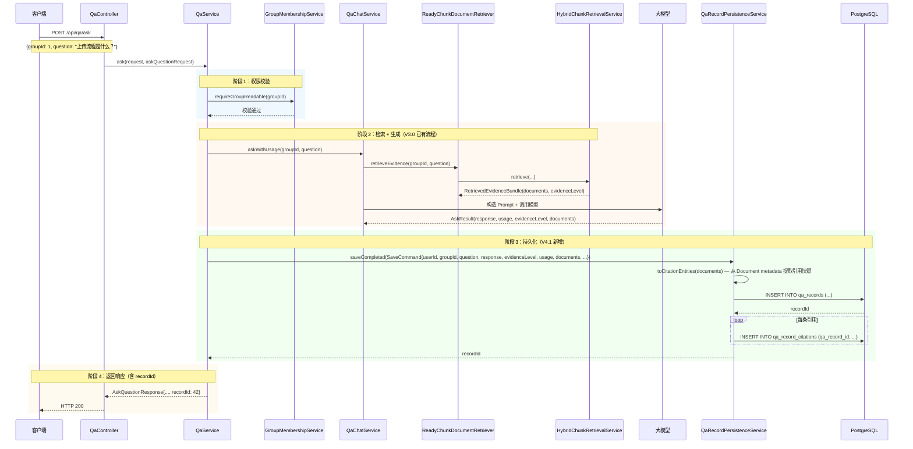
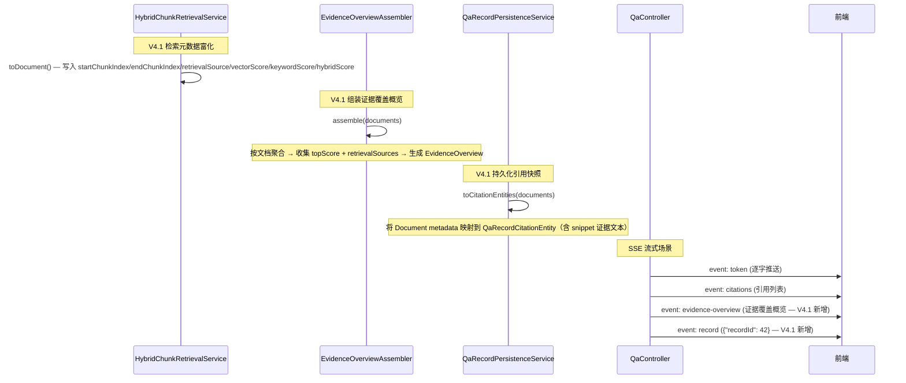

# Argus V4.1 设计决策

> 本文档是 [V4.1-项目文档.md](V4.1-项目文档.md) 第五章"核心设计决策"的详细展开，
> 逐一阐述 V4.1 QA 记录持久化与 Chunk 证据链中每一项架构决策的**问题背景、解决方案、实现细节和工程权衡**。
>
> 返回主文档：[V4.1-项目文档.md](V4.1-项目文档.md)

---

## 4.7 QA 记录持久化：完整证据截面快照

### 为什么需要持久化

V3.0 的问答流程完整且正确——检索 → 评估 → 生成 → 返回。但这一切发生在内存中，请求结束后便烟消云散。两个实际痛点：

1. **用户视角**："上周我问过'上传流程是什么'，当时引用了哪些文档来着？"——无法回答。用户只能重新提问，而新的回答可能引用不同的文档（知识库在更新，检索结果不同）。
2. **运维视角**：哪些群组的问答量最大？拒答率多高？平均每次问答消耗多少 Token？哪些文档被引用频率最高？没有数据沉淀，这些分析无从谈起。

### 解决方案：以问答为单位保存完整证据截面

`QaRecordPersistenceService` 在每次问答完成后，将以下信息作为一个原子记录写入数据库：

- **问答元数据**：谁、在哪个群组、何时、通过哪个接口（同步/流式）、用了哪个模型
- **问答结果**：问题原文、回答正文（或拒答原因）、是否成功回答
- **检索质量**：证据充分度等级（NONE/WEAK/PARTIAL/SUFFICIENT）
- **资源消耗**：prompt_tokens、completion_tokens、total_tokens、是否为估算值、端到端延迟
- **证据截面**：每条检索到的文档切片 → `qa_record_citations` 快照

### 完整时序图（同步问答 + 持久化）



### 实现细节

#### SaveCommand：持久化所需的全量上下文

```java
public record SaveCommand(
        Long userId,           // 提问用户
        Long groupId,          // 所属群组
        String question,       // 原始问题
        String endpoint,       // QA_ASK / QA_STREAM_ASK
        String modelName,      // 模型名称
        AskQuestionResponse response,       // 问答结果（回答正文或拒答原因）
        EvidenceLevel evidenceLevel,       // 证据充分度
        QaChatService.UsageInfo usage,     // Token 用量 + 延迟
        List<Document> evidenceDocuments,  // 检索返回的证据文档（含完整 metadata）
        boolean success,       // 流程是否成功（拒答为 false，系统异常为 false）
        String errorMessage    // 异常信息（业务拒答时为 null）
) {}
```

设计意图：`SaveCommand` 把所有持久化需要的信息打包为一个不可变对象。调用方（`QaService`）负责组装，持久化服务（`QaRecordPersistenceService`）负责提取和写入。两者之间的契约清晰——新增持久化字段只需扩展 `SaveCommand` 和对应的 INSERT SQL。

#### 从 Document metadata 提取引用快照

检索引擎在组装 `Document` 时已经将丰富的元数据写入 `metadata` Map。`QaRecordPersistenceService.toCitationEntity()` 从 metadata 中提取快照：

```java
private QaRecordCitationEntity toCitationEntity(Document document, LocalDateTime now) {
    Map<String, Object> metadata = document.getMetadata();
    // 文件名：优先取 fileName，回退取 documentName
    String fileName = readText(metadata, "fileName");
    if (!StringUtils.hasText(fileName)) {
        fileName = readText(metadata, "documentName");
    }
    // ... 提取 documentId、chunkId、chunkIndex、start/endChunkIndex
    // ... 提取 score、retrievalSource、vectorScore、keywordScore、hybridScore
    entity.setSnippet(snippet(document.getText()));  // 截断到 1200 字符
    return entity;
}
```

关键设计：`snippet()` 保存的是**模型实际看到的证据文本**（包含"文件名：xxx"前缀和窗口扩展后的切片文本拼接）。即使后续文档被修改或删除，快照中仍保留当时的完整证据上下文——这是"可复盘性"的核心保障。

#### 持久化失败的静默降级

```java
public Long saveCompleted(SaveCommand command) {
    try {
        // ... 写入数据库 ...
        return record.getId();
    } catch (Exception exception) {
        log.warn("QA record persistence failed. userId={}, groupId={}, endpoint={}",
                command.userId(), command.groupId(), command.endpoint(), exception);
        return null;  // 返回 null，不影响问答主流程
    }
}
```

持久化是**旁路操作**——用户已经收到了问答结果，不应因为数据库写入失败而影响用户体验。`saveCompleted` 的 try-catch 将所有异常吞掉并记录日志，返回 `null` 表示持久化失败。调用方通过 `AskQuestionResponse.recordId` 是否为 null 判断持久化是否成功。

### 可见性过滤：MyBatis 动态 SQL 而非 Java 内存过滤

QA 历史查询必须保证用户只能看到自己有权限的记录。两个选择：

1. **Java 层过滤**：先查出所有记录，再用 Java Stream 过滤。
2. **SQL 层过滤**：在 SQL 查询中嵌入可见性条件。

选择方案 2（SQL 层过滤），因为分页场景下方案 1 会查出不属于用户的记录再丢弃，既浪费带宽又无法正确计算 `total` 计数。

实现方式：MyBatis 的 `<sql>` 可复用片段 + `<choose>` 动态标签：

```xml
<sql id="visiblePredicate">
    <choose>
        <when test="systemAdmin">
            1 = 1  <!-- 管理员无视过滤 -->
        </when>
        <otherwise>
            EXISTS (
                SELECT 1 FROM group_memberships gm
                WHERE gm.group_id = r.group_id
                  AND gm.user_id = #{currentUserId}
                  AND (r.user_id = #{currentUserId} OR gm.role = 'OWNER')
            )
        </otherwise>
    </choose>
</sql>
```

该片段同时用于 `selectVisibleRecords`（分页查询）、`countVisibleRecords`（总数统计）和 `selectVisibleRecord`（单条详情），确保三种查询的可见性规则一致。

权限规则解释：
- 用户必须是该群组的成员（`gm.user_id = #{currentUserId}`）
- 且要么是记录的提问者本人，要么是该群组的 OWNER（OWNER 可以看到群组内所有成员的问答记录）

### 权衡

**收益**：
- 问答结果可追溯——用户可回看历史问答和当时的引用来源
- 运维可分析——问答量、成功率、Token 消耗、延迟分布等指标有了数据基础
- 证据截面不可变——即使文档被删除或修改，快照仍保留当时的证据内容
- 持久化失败不影响主流程——用户体验不受数据库故障影响

**代价**：
- 每次问答增加 1~N+1 次 INSERT 操作（1 条 qa_records + N 条 qa_record_citations），增加约 5~20ms 延迟
- 引用快照的 `snippet` 字段存储完整证据文本（≤1200 字符），存储开销随问答量线性增长
- 可见性过滤依赖 SQL 子查询（EXISTS + group_memberships 联表），在高问答量场景下需要关注索引效率

---

## 4.8 Chunk 证据链结构化：从检索到展示的完整追溯

### 为什么需要证据链

V3.0 的检索结果以 `List<Document>` 的形式注入 LLM，前端只能看到 `citationAssembler` 输出的简单引用列表（documentId、chunkId、fileName、score）。三个信息缺口：

1. **切片范围不可见**：一条引用背后可能对应多个切片（邻居窗口扩展），但前端只看到 primaryChunkIndex，不知道模型实际看到了 chunk-2 到 chunk-4 的完整内容。
2. **检索通道不可知**：这条切片是向量检索命中的还是关键词检索命中的？还是双通道都命中了（置信度更高）？前端无从判断。
3. **评分维度单一**：前端只看到一个综合 score，无法区分向量评分和关键词评分的贡献。如果某条证据向量评分很高但关键词评分为 0，可能是语义相近但关键词不匹配的"弱证据"。

此外，这些信息在回答完成后即消失——因为没有持久化，无法在历史回看时重现当时的证据全景。

### 解决方案：三层证据链架构

```
检索层（HybridChunkRetrievalService）
    ↓ 在 Document.metadata 中携带完整元数据
组装层（EvidenceOverviewAssembler）
    ↓ 按文档聚合 → 按切片展开 → 附加来源标记
展示层（API Response / SSE Event）
    ↓ EvidenceOverview → 前端 CitationRail + EvidenceOverviewPanel
持久层（QaRecordPersistenceService）
    ↓ 引用快照落库，支持历史复盘
```

#### 第一层：检索层元数据富化

`HybridChunkRetrievalService.toDocument()` 在组装 `Document` 时，将以下元数据写入 `metadata`：

```java
Map<String, Object> metadata = new LinkedHashMap<>();
metadata.put("evidenceId", evidenceId);              // E1, E2, E3 ...
metadata.put("groupId", groupId);
metadata.put("documentId", documentId);
metadata.put("chunkId", chunkId);
metadata.put("chunkIndex", chunkIndex);              // 主切片序号
metadata.put("primaryChunkId", cluster.primaryChunkId());
metadata.put("primaryChunkIndex", cluster.primaryChunkIndex());
metadata.put("startChunkIndex", cluster.expandedStartChunkIndex(neighborWindow));  // 扩展后起始
metadata.put("endChunkIndex", cluster.expandedEndChunkIndex(neighborWindow));      // 扩展后结束
metadata.put("fileName", fileName);
metadata.put("score", normalizeScore(cluster.rankingScore()));  // 归一化 RRF 评分
metadata.put("retrievalSource", cluster.source());   // BOTH / VECTOR / KEYWORD
metadata.put("coverageMode", coverageMode);          // RELEVANCE_ONLY / DOCUMENT_COVERAGE
metadata.put("vectorScore", cluster.vectorScore());  // 向量通道原始评分
metadata.put("keywordScore", cluster.keywordScore());// 关键词通道原始评分
metadata.put("hybridScore", cluster.rankingScore()); // RRF 融合原始评分（未归一化）
```

关键设计：每个 Document 成为一个**自描述的证物**——不依赖外部上下文就能完整解释"这条证据从哪来、怎么找到的、质量如何"。

#### RRF 评分归一化

V3.0 的 RRF 评分使用 `k=60` 的传统公式，评分域为 `[0, ~0.03]`——数值密集、缺乏区分度。V4.1 改用 `k=0` + 指数饱和函数归一化：

```java
// RRF 累加：k=0 使 rank-1 获得权重 1.0
private double reciprocalRank(int rank) {
    return 1D / (RRF_K + Math.max(rank, 1));  // RRF_K = 0
}

// 归一化：1 - e^(-x)，将 [0, +∞) 映射到 [0, 1)
private double normalizeScore(double rawRrfScore) {
    return 1.0 - Math.exp(-rawRrfScore);
}
```

典型映射效果：

| 命中情况 | 原始 RRF 累加值 | 归一化评分 | 含义 |
|---------|----------------|-----------|------|
| 单通道 rank-1 | 1.0 | 0.63 | 仅一个通道排名第一 |
| 双通道 rank-1 | 2.0 | 0.86 | 两个通道都排名第一，置信度高 |
| 多次高排名命中 | ≥ 3.0 | ≥ 0.95 | 多条查询、两个通道都命中 |

指数饱和函数的特性：边际递减——每增加一份独立证据，分数增幅逐渐变小，符合"证据积累"直觉。且无需硬编码除数，不受查询条数和 topK 变化的影响。

#### 第二层：证据覆盖概览组装

`EvidenceOverviewAssembler` 将扁平的 `List<Document>` 转换为按文档聚合的层级 `EvidenceOverview`：

```java
public AskQuestionResponse.EvidenceOverview assemble(List<Document> documents) {
    // 1. 读取 coverageMode（所有 Document 共享同一个模式）
    String coverageMode = readCoverageMode(documents);

    // 2. 按 (documentId, fileName) 分组
    Map<String, GroupAccumulator> groups = new LinkedHashMap<>();
    for (Document document : documents) {
        GroupAccumulator group = groups.computeIfAbsent(key, ...);
        group.add(toSnippet(document));  // 收集切片摘要 + 更新 topScore + 合并 retrievalSources
    }

    // 3. 输出聚合结果
    return new EvidenceOverview(
            groups.size(),           // 涉及文档数
            documents.size(),        // 证据切片数
            coverageMode,
            groups.values().stream().map(GroupAccumulator::toGroup).toList(),
            buildWarnings(coverageMode, groups.size())
    );
}
```

`GroupAccumulator` 在聚合过程中：
- 记录该文档下所有证据切片（EvidenceSnippet）
- 维护 `topScore`（该文档的最高评分）
- 收集所有 `retrievalSource` 并去重（如 `["BOTH", "VECTOR"]` 表示该文档有双通道命中的切片，也有仅向量命中的切片）

#### 第三层：跨文档覆盖模式

当用户问题包含"每个文档""所有文档""按文档"等关键词时，`shouldPreferDocumentCoverage()` 返回 true，触发 `DOCUMENT_COVERAGE` 模式：

```java
private List<RetrievalCandidate> selectRankedCandidates(
        List<RetrievalCandidate> sortedCandidates,
        int topK,
        boolean preferDocumentCoverage) {
    if (!preferDocumentCoverage) {
        return sortedCandidates.stream().limit(topK).toList();  // 默认：按评分取 topK
    }
    // 第一轮：每个文档各取一个最高分切片
    for (RetrievalCandidate candidate : sortedCandidates) {
        if (coveredDocumentIds.add(candidate.documentId())) {
            selectedCandidates.add(candidate);
        }
    }
    // 第二轮：如果还没满 topK，用剩余切片填充
    for (RetrievalCandidate candidate : sortedCandidates) {
        if (selectedChunkIds.add(candidate.chunkId())) {
            selectedCandidates.add(candidate);
        }
    }
    return selectedCandidates;
}
```

这个算法确保当用户问"每个文档的上传流程是怎样的"时，系统不会只返回一个文档的多个高分切片，而是覆盖多个文档的高分切片。

#### 第四层：历史快照重建

查看历史 QA 记录时，证据 Document 已经不存在于内存中——只有 `qa_record_citations` 表中的引用快照。`EvidenceOverviewAssembler.assembleHistoryCitations()` 从快照重建与实时检索完全相同结构的 `EvidenceOverview`：

```java
public EvidenceOverview assembleHistoryCitations(List<QaRecordDetailVO.Citation> citations) {
    // 结构完全对称于 assemble(List<Document>)，但：
    // - coverageMode 固定为 "HISTORY_SNAPSHOT"
    // - evidenceId 为 null（快照中没有 evidenceId 概念）
    // - 数据源是 QaRecordDetailVO.Citation 而非 Document
}
```

`coverageMode = "HISTORY_SNAPSHOT"` 是关键区分标记——前端可据此判断这是实时检索结果还是历史快照，并调整 UI 展示（例如禁用到文档详情页的跳转链接）。

### 完整证据链数据流



### 权衡

**收益**：
- **证据可解释**：每条证据的来源文档、切片范围、检索通道、各维度评分一目了然
- **检索质量可评估**：通过对比 `vectorScore` 和 `keywordScore`，可以判断一个切片是语义匹配还是关键词匹配；`BOTH` 来源的切片置信度明显高于单一通道
- **跨场景复用**：`EvidenceOverview` 结构同时服务于实时问答响应、SSE 流式推送和历史快照重建，三种场景零重复代码
- **跨文档覆盖**：`DOCUMENT_COVERAGE` 模式解决了"问所有文档但只返回一个文档"的常见 RAG 缺陷

**代价**：
- 每个 `Document` 的 metadata 从 ~5 个字段增加到 ~15 个字段，内存开销轻微增加
- `evidence-overview` SSE 事件的 JSON 体积可能较大（含所有切片的 snippet 文本），在文档数量多时需关注推送延迟
- `DOCUMENT_COVERAGE` 模式依赖关键词匹配触发而非语义理解，存在漏触发（用户用"分别看看各个文档"可能匹配，"看看文档们都怎么说"可能不匹配）

---

## 4.9 流式问答的滞后持久化

### 为什么流式场景的持久化更复杂

同步问答的持久化很简单——`QaChatService.askWithUsage()` 返回完整的 `AskResult`（response + usage + evidenceLevel + documents），`QaService` 直接调用 `saveQaRecord()` 落库，然后返回含 `recordId` 的响应。

流式问答则不同：
1. **回答正文不在响应时完成**——SSE 的 `token` 事件逐个推送文本片段，完整回答正文要到流结束后才拼接完成。
2. **Token 用量在流结束后才确定**——`UsageInfo` 在 `Flux.doOnComplete` 回调中才获得（通过 `onUsageReady` consumer）。
3. **持久化不能阻塞 SSE 流**——如果在 `doOnComplete` 中执行同步数据库写入，用户会额外等待数十毫秒才能收到 `done` 事件。

### 解决方案：Flux 包装 + AtomicReference 回传

`QaService.askStream()` 创建一个包装的 `Flux<String>`，在原 token 流的基础上附加持久化行为：

```java
public StreamContext askStream(HttpServletRequest request, AskQuestionRequest askQuestionRequest) {
    // ...
    StringBuilder answerBuilder = new StringBuilder();
    AtomicReference<Long> recordIdRef = new AtomicReference<>();

    Flux<String> persistedTokenStream = rawContext.tokenStream()
            .doOnNext(answerBuilder::append)       // 边推送边收集完整回答
            .doOnComplete(() -> {
                // 流完成 → 组装完整回答 → 落库
                AskQuestionResponse response = AskQuestionResponse.answered(
                        answerBuilder.toString(), List.of());
                Long recordId = saveQaRecord(userId, groupId, question,
                        LlmEndpoint.QA_STREAM_ASK, response, evidenceLevel,
                        usageRef.get(), rawContext.documents(), true, null);
                recordIdRef.set(recordId);
            })
            .doOnError(error -> {
                // 异常 → 记录失败信息
                Long recordId = saveQaRecord(..., false, errorMessage);
                recordIdRef.set(recordId);
            });

    return new StreamContext(persistedTokenStream, rawContext.documents(),
            rawContext.evidenceLevel(), recordIdRef);
}
```

`QaController.streamAsk()` 在这个包装流完成后，读取 `recordIdRef` 并通过 SSE 的 `record` 事件发送给前端：

```java
.doOnComplete(() -> {
    // ... 发送 citations 和 evidence-overview ...
    Long recordId = streamContext.recordId();   // 读取 AtomicReference
    if (recordId != null) {
        emitter.send(SseEmitter.event().name("record")
                .data(Map.of("recordId", recordId)));
    }
    emitter.complete();
})
```

### SSE 事件顺序保证

流式回答的 SSE 事件顺序经过精心设计：

```
token (×N) → citations → evidence-overview → record → [SSE 连接关闭]
```

- `citations` 和 `evidence-overview` 在 `token` 全部推送后发送，因为此时 `streamContext.documents()` 中的证据数据已经是完整的
- `record` 在最后发送，因为 `recordId` 需要等待持久化写入完成后才能获得
- 如果持久化失败（`recordId == null`），`record` 事件不发送——前端通过 `recordId` 是否存在判断持久化是否成功

### 权衡

**收益**：
- 流式持久化的行为与同步持久化完全一致——相同的字段、相同的 `SaveCommand`、相同的 `QaRecordPersistenceService`
- 前端可通过 `record` 事件关联流式回答与持久化记录，实现"聊天完成后一键查看详情"
- 失败路径也落库，确保问题排查有数据支撑

**代价**：
- `doOnComplete` 中的数据库写入发生在 SSE 推送线程上（Reactor 的 Scheduler），会延长 `done` 事件的发送时机
- 如果持久化失败（`recordId == null`），前端无法通过 API 查询到该条流式回答的记录——但用户已经收到了完整回答，只是历史记录中缺失
- 流式场景下 `evidence-overview` 无法包含 `answer`（回答正文在 `doOnNext` 中才拼接完成），因此 SSE 的 `evidence-overview` 事件中不包含引用组装后的 citations 与回答的关联关系

---

> 返回主文档：[V4.1-项目文档.md](V4.1-项目文档.md)
